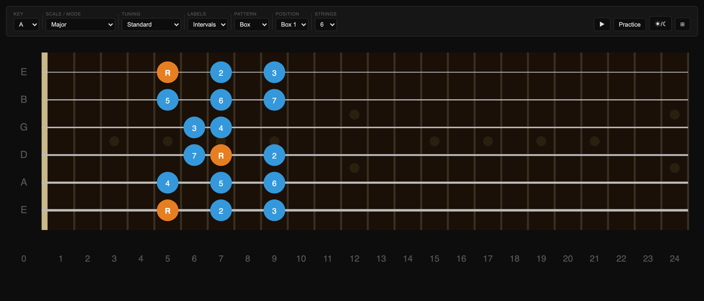
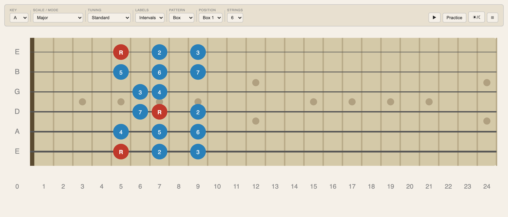

# Fretboard Navigator

Interactive guitar fretboard for visualizing scales, modes, chords, and box patterns.

**▶ Launch:** https://jchristof.github.io/fretboard-navigator/

No install, no sign-in — open the link and start clicking.




---

## Controls

| Control | What it does |
|---|---|
| **Key** | Root note (A–G#). |
| **Scale / Mode** | Diatonic scales (Major, Natural/Harmonic Minor, Pentatonic Major/Minor, Blues, Dorian, Phrygian, Lydian, Mixolydian, Locrian, Whole Tone, Diminished) and chord arpeggios (Major/Minor Triad, Dom 7, Maj 7, Min 7, Dim, Aug, Sus2, Sus4). |
| **Tuning** | Standard, Drop D, Open G/D/E, DADGAD, Half Step Down. |
| **Labels** | Dot labels: note names, intervals (R, b3, 5…), scale degrees (♯/♭), or none. |
| **Pattern** | **All** — every scale tone across the neck. **Box** — 5-fret window anchored on the position's degree; duplicates across adjacent strings are deduped. **3 NPS** — three notes per string, climbing strictly upward from the anchor. |
| **Position** | **Box 1–7.** Each box anchors on the Nth scale degree's occurrence on the lowest string. Open strings are included when the anchor falls at fret 0. Boxes beyond the scale's note count cycle to the next octave anchor. |
| **Strings** | 4–8 strings. |
| **▶** | Play the active scale ascending, or strum the chord. |
| **Practice** | Quiz mode — clicking a dot prompts an interval or note-name question with multiple-choice answers and a running score. |
| **☀/☾** | Toggle dark / light theme. |
| **⊞** | Toggle single-row / double-row controls layout. |

**Click a dot** to hear that pitch through the Web Audio API.

All settings (key, scale, tuning, theme, layout, etc.) persist to `localStorage` and are restored on reload.

---

## Running locally

ES modules require an HTTP origin — opening `index.html` directly via `file://` will not work.

```bash
python3 -m http.server 8000
# then open http://localhost:8000/
```

No build step, no dependencies. Plain HTML / CSS / vanilla ES modules.

## Running the tests

`music.js` (notes, scales, chord intervals, MIDI conversion) has Node-runnable unit tests:

```bash
node tests/test-music.mjs
```
